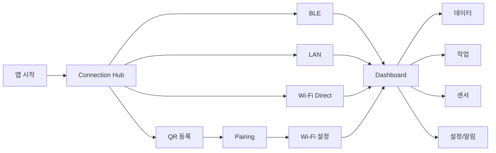
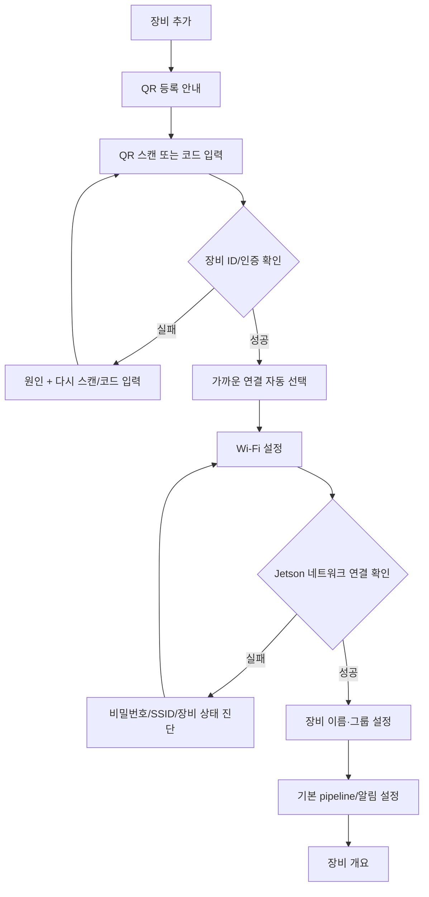
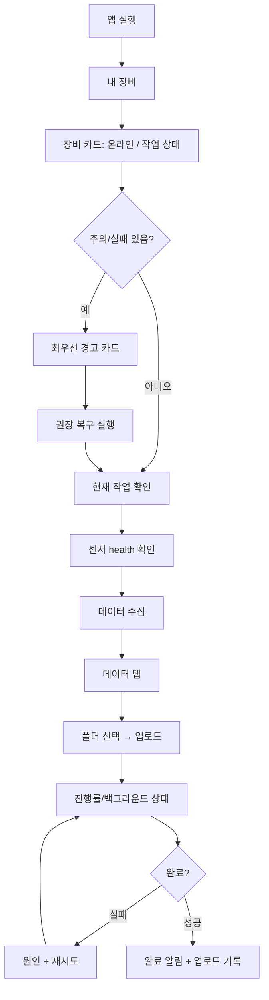
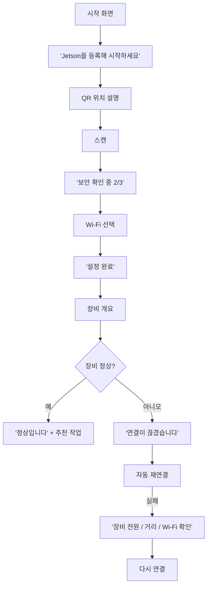

# JetsonControllerApp UI/UX 재설계 및 제품 확장 실행 명세

> **분석 기준:** 2026-08-13 KST, GitHub `main`, 분석 시점 트리 SHA `cf542397…`. Android 앱은 `versionName 1.3.1`, `minSdk 31`, `targetSdk 37`이며 Jetpack Compose + Material 3, Navigation Compose, CameraX/ML Kit, Retrofit/OkHttp를 사용한다. fileciteturn2file0L2-L2 fileciteturn29file0L2-L2
> **분석 방법:** 실제 APK를 실행한 사용성 테스트가 아니라 저장소의 현재 `main` 소스, 백엔드 구현, 배포 감사 문서와 Android/NVIDIA 공식 가이드를 바탕으로 한 정적 UI/UX 감사다. 저장소에는 런처 이미지 외에 현행 UI 스크린샷/디자인 산출물이 확인되지 않아, 아래의 화면 평가는 Compose 구현을 기준으로 재구성했다. 따라서 실제 제조사별 폰 렌더링, TalkBack 낭독 순서, 애니메이션 체감, 실장비 네트워크 지연은 별도 검증 대상이다. fileciteturn2file0L2-L2

## 실행 요약

JetsonControllerApp은 이미 단순 BLE 리모컨을 넘어 **QR 기반 장비 신뢰 설정 → BLE/LAN/Wi‑Fi Direct 연결 → 실시간 상태 확인 → Wi‑Fi provisioning → 저장소/업로드 → Python pipeline 운영 → 센서 상태 → 알림**까지 갖춘 상당히 강한 현장 운영 도구다. 현재 백엔드도 요청·응답 HMAC, nonce/timestamp replay 방어, 장비별 TLS 인증서 고정, Android Keystore 보호, 업로드 재개·hash·retry 등 운영 제품에 필요한 보안 기반을 상당 부분 갖추고 있다. fileciteturn26file0L2-L2 fileciteturn27file0L2-L2

그러나 **기능 구조가 사용자 작업 구조보다 앞서 있다.** 사용자는 “BLE/LAN/API/pipeline/YAML”을 다루는 것이 목적이 아니라, “이 Jetson이 정상인가?”, “지금 데이터를 수집하고 있는가?”, “실패하면 무엇을 해야 하는가?”, “오늘 현장 데이터를 안전하게 올렸는가?”를 알고 싶다. 현 UI는 기능별 화면 품질은 좋은 편이지만, 연결 방식·개발자 용어·세부 기능이 제품의 최상위 정보구조를 결정하고 있어 초보자와 운영자의 인지 부담이 크다. 예를 들어 등록 장비가 없으면 설명 화면 없이 QR 스캐너로 자동 이동하고, Wi‑Fi Direct 완료 화면에는 “API”라는 내부 구현 용어가 노출되며, Pipeline 화면은 Git branch·Python·YAML·exit code를 운영자에게 그대로 보여 준다. fileciteturn35file0L2-L2 fileciteturn17file0L2-L2 fileciteturn18file0L2-L2

**재설계의 핵심은 “connection-first”에서 “device/task-first”로 전환하는 것**이다.

```text
현재 mental model
연결 방식 선택 → 연결 → Dashboard → 기능 찾기

목표 mental model
내 장비 선택 → 현재 건강/작업 상태 확인 → 해야 할 일 수행
                    ↓
            필요할 때만 연결 방식 노출
```

가장 먼저 구현할 것은 새로운 시각 효과가 아니라 다음 네 가지다.

| 우선순위 | 결정 |
|---|---|
| P0 | `장비 → 개요 → 데이터/작업/센서/알림` 중심으로 IA를 재편하고 연결 수단은 장비 상세의 하위 개념으로 만든다. |
| P0 | 최초 QR 등록을 “갑작스러운 카메라 화면”이 아니라 3단계 guided onboarding으로 만든다. |
| P0 | 관리자/운영자/초보자의 위험 작업 노출을 분리하고, reboot/shutdown/pipeline 변경 같은 제어는 향후 서버 측 role authorization까지 확장한다. |
| P0 | 상태·경고·마지막 갱신·실패 원인·다음 행동을 하나의 일관된 `Status/Alert/Recovery` 컴포넌트 체계로 통합한다. |

휴리스틱 평가는 Nielsen의 시스템 상태 가시성, 현실 세계와의 일치, 사용자 통제, 일관성, 오류 예방, 인식 우선, 효율성, 최소주의, 오류 복구, 도움말 원칙을 기준으로 하되, 이 보고서에서는 요청에 맞추어 심각도를 **1–5**로 별도 정의한다. citeturn4search0turn4search1

## 현행 제품 및 UI 분석

**현재 화면 지도.** 실제 navigation root는 [`JetsonApp.kt`](https://github.com/dbparkJ/JetsonControllerApp/blob/main/app/src/main/java/com/example/jetsoncontroller/ui/JetsonApp.kt)이며 `connection_hub`가 시작점이다. 코드상 QR, BLE, Wi‑Fi Direct, Dashboard, Wi‑Fi 설정, Storage, Upload, Pipelines, Sensors, Settings 등의 route가 한 `NavHost`에 집중되어 있다. fileciteturn34file0L2-L2

| 영역 | 현재 화면 / 역할 | 관련 코드 |
|---|---|---|
| 장비 진입 | LAN 자동 발견, QR/BLE/Wi‑Fi Direct 진입 | [`ConnectionHubScreen.kt`](https://github.com/dbparkJ/JetsonControllerApp/blob/main/app/src/main/java/com/example/jetsoncontroller/ui/connection/ConnectionHubScreen.kt) |
| BLE | 등록 장비/주변 장비 목록, 재연결, 삭제 | [`DeviceListScreen.kt`](https://github.com/dbparkJ/JetsonControllerApp/blob/main/app/src/main/java/com/example/jetsoncontroller/ui/devices/DeviceListScreen.kt) fileciteturn12file0L2-L2 |
| 신규 등록 | QR 카메라 스캔 → 장비 확인 → 인증 진행 | [`QrScannerScreen.kt`](https://github.com/dbparkJ/JetsonControllerApp/blob/main/app/src/main/java/com/example/jetsoncontroller/ui/pairing/QrScannerScreen.kt), [`PairingScreen.kt`](https://github.com/dbparkJ/JetsonControllerApp/blob/main/app/src/main/java/com/example/jetsoncontroller/ui/pairing/PairingScreen.kt) fileciteturn14file0L2-L2 fileciteturn13file0L2-L2 |
| 직접 연결 | Wi‑Fi Direct discovery → peer 연결 → 인증 API 확인 | [`WifiDirectScreen.kt`](https://github.com/dbparkJ/JetsonControllerApp/blob/main/app/src/main/java/com/example/jetsoncontroller/ui/wifi/WifiDirectScreen.kt) fileciteturn17file0L2-L2 |
| 운영 홈 | 연결 정보, CPU/GPU/온도/스토리지/RAM, 주요 기능, 재부팅/종료 | [`DashboardScreen.kt`](https://github.com/dbparkJ/JetsonControllerApp/blob/main/app/src/main/java/com/example/jetsoncontroller/ui/dashboard/DashboardScreen.kt) |
| 네트워크 | AP 검색, Wi‑Fi credential 입력, hidden SSID | [`NetworkSettingsScreen.kt`](https://github.com/dbparkJ/JetsonControllerApp/blob/main/app/src/main/java/com/example/jetsoncontroller/ui/network/NetworkSettingsScreen.kt) fileciteturn16file0L2-L2 |
| 데이터 | 디렉터리 탐색, 이미지/UTF‑8 preview, 업로드 시작 | [`DeviceStorageScreen.kt`](https://github.com/dbparkJ/JetsonControllerApp/blob/main/app/src/main/java/com/example/jetsoncontroller/ui/storage/DeviceStorageScreen.kt) fileciteturn19file0L2-L2 |
| 업로드 | 대상 선택 → 진행률/취소/재시도 → 기록 | [`UploadConfirmScreen.kt`](https://github.com/dbparkJ/JetsonControllerApp/blob/main/app/src/main/java/com/example/jetsoncontroller/ui/upload/UploadConfirmScreen.kt), [`UploadProgressScreen.kt`](https://github.com/dbparkJ/JetsonControllerApp/blob/main/app/src/main/java/com/example/jetsoncontroller/ui/upload/UploadProgressScreen.kt), [`UploadHistoryScreen.kt`](https://github.com/dbparkJ/JetsonControllerApp/blob/main/app/src/main/java/com/example/jetsoncontroller/ui/upload/UploadHistoryScreen.kt) fileciteturn22file0L2-L2 fileciteturn23file0L2-L2 fileciteturn24file0L2-L2 |
| 작업 | pipeline 목록/시작/중지/재시작/등록/로그/YAML/output | [`PipelineScreens.kt`](https://github.com/dbparkJ/JetsonControllerApp/blob/main/app/src/main/java/com/example/jetsoncontroller/ui/pipelines/PipelineScreens.kt) fileciteturn18file0L2-L2 |
| 센서 | Camera/GNSS/IMU configured/running 상태 | [`SensorScreen.kt`](https://github.com/dbparkJ/JetsonControllerApp/blob/main/app/src/main/java/com/example/jetsoncontroller/ui/sensors/SensorScreen.kt) fileciteturn20file0L2-L2 |
| 알림 | storage/temperature threshold, pipeline start/failure notification | [`AlertSettingsScreen.kt`](https://github.com/dbparkJ/JetsonControllerApp/blob/main/app/src/main/java/com/example/jetsoncontroller/ui/settings/AlertSettingsScreen.kt) fileciteturn21file0L2-L2 |

**현 navigation flow.** 연결 이후의 주요 화면에는 `홈 / 데이터 / 작업 / 센서 / 설정`의 5개 Material `NavigationBar` destination이 있으며, Overview·Data·Pipelines·Sensors·Settings가 각각 Dashboard·Storage·Pipelines·Sensors·AlertSettings로 매핑된다. 반면 Dashboard 안에도 Wi‑Fi, Wi‑Fi Direct, Storage, Upload History, Pipeline shortcut이 다시 존재해 “전역 destination”과 “홈 shortcut”의 역할이 일부 중복된다. fileciteturn35file0L2-L2



등록 장비가 하나도 없으면 `Connection Hub`에 머물지 않고 QR scanner로 자동 이동하고, QR/BLE pairing이 `READY`가 되면 Wi‑Fi 설정으로 자동 이동한다. 보안상 QR bootstrap 자체는 타당하지만, “왜 카메라가 열렸는가 / QR은 어디에 있는가 / 이후 어떤 단계가 남았는가”를 설명하는 onboarding 화면이 생략되어 있다. fileciteturn35file0L2-L2

**현재 UI 구성요소와 시각 언어.** 앱은 Material 3 `Scaffold`, `TopAppBar`, `NavigationBar`, `Surface`, `ListItem`, `OutlinedCard`, `Button`, `Switch`, `Slider`, `AlertDialog`, progress indicator 등을 일관되게 활용하고, 공용 `SectionHeader`, `InlineMessage`, `EmptyState`, `MetricCard`도 이미 존재한다. Dashboard metric은 14dp 내부 padding의 surface card, 주요 화면은 대체로 20dp horizontal content padding을 사용한다. fileciteturn31file0L2-L2

현재 브랜드 팔레트는 light 기준 `#006B5F` teal primary, `#405F8C` blue secondary, `#815500` amber tertiary이고 dark 대응색도 별도로 있다. 배경은 `#F7F9F8`, surface `#FFFFFF`; 다크 배경은 `#101413`이다. 이 palette는 산업/장비 제어 앱에 적합한 차분한 방향이므로 **브랜드 색을 버리기보다 semantic state layer를 추가**하는 것을 권장한다. fileciteturn33file0L2-L2

현재 정의된 색 중 예를 들어 `#727875` 대 흰색의 계산상 명암비는 약 **4.51:1**로 일반 텍스트 WCAG AA 4.5:1 기준에 매우 근접한다. 따라서 기본 palette 자체를 실패로 간주할 근거는 없지만, alpha 적용 container, disabled state, camera preview 위 흰색 문구, pipeline 상태색 등 실제 조합은 자동 contrast 검사를 CI에 추가해야 한다. WCAG 2.2는 일반 텍스트에 4.5:1, 큰 텍스트에 3:1을 제시한다. fileciteturn33file0L2-L2 citeturn3search2turn3search3

**사용성에서 잘 된 점**도 명확하다. Wi‑Fi 화면은 선택한 AP 행 바로 아래에 password form을 확장하고 IME 등장 시 해당 항목을 화면 안으로 가져오며, 비밀번호 표시/숨김, 비지원 Enterprise/WEP 안내, loading 상태를 처리한다. Upload는 실제 byte/file progress, 실패 재시도, 취소 전 partial-data 경고를 제공한다. Shutdown/reboot와 pipeline 등록 해제에는 확인 대화상자가 존재한다. fileciteturn16file0L2-L2 fileciteturn23file0L2-L2 fileciteturn18file0L2-L2

**접근성은 “기본기는 있으나 체계화되지 않은 상태”**다. 주요 `IconButton`에 “뒤로”, “새로고침”, “저장된 장비 삭제”, “중지” 같은 `contentDescription`이 존재하는 것은 좋다. 반면 앱의 거의 모든 UI 문자열이 composable 안에 직접 하드코딩되어 있고 `strings.xml`에는 현재 `app_name` 하나만 존재해 localization과 접근성 문구 관리가 어려우며, 비동기 상태 변화에 `liveRegion` 같은 명시적 semantics가 사용된 흔적은 확인되지 않았다. fileciteturn12file0L2-L2 fileciteturn18file0L2-L2 fileciteturn32file0L2-L2 Android Compose는 상태 메시지처럼 자동 낭독해야 하는 콘텐츠에 `liveRegion` semantics를 제공하고, 시각 요소 description을 지역화된 리소스로 관리하는 접근을 권장한다. citeturn3search9turn3search15

QR 등록 역시 카메라 permission 거부 상태와 camera startup error는 잘 처리하지만, **수동 코드 입력/clipboard import 같은 비시각 대체 경로가 없다**. 또한 scanner 화면에서 성공 시각·촉각 피드백이나 flashlight control은 현재 구현에서 확인되지 않는다. QR frame은 화면 폭의 70%를 사용하는 카메라 overlay다. fileciteturn14file0L2-L2

**성능/피드백 관점의 중요한 코드 이슈**가 하나 있다. `DashboardViewModel`은 연결된 transport가 BLE가 아닐 경우 2초마다 무한 루프로 `refreshStatus()`를 호출한다. 이 ViewModel은 root `JetsonApp`에서 만들어지므로 사용자가 Data/Pipeline/Settings 탭에 있어도 연결이 유지되는 동안 polling이 계속될 수 있다. 따라서 “최근 갱신 3초 전” 표시와 함께 화면 가시성/foreground 상태에 따라 cadence를 2초 → 5~10초 → background stop으로 조정하거나 장기적으로 event stream을 도입하는 편이 낫다. fileciteturn25file0L2-L2 fileciteturn34file0L2-L2

**테스트 현황**은 backend 쪽이 상대적으로 강하다. 배포 감사 문서에는 backend unit test 42개 통과와 Android unit/lint/debug APK/androidTest APK build 통과가 기록되어 있다. 반면 현재 트리에서 feature-specific Compose instrumentation test는 `NetworkSettingsScreenTest.kt`가 확인되는 정도라 Dashboard·onboarding·pipeline·storage·accessibility에 대한 화면 단위 regression coverage는 확장할 필요가 있다. fileciteturn26file0L2-L2 fileciteturn2file0L2-L2

## 휴리스틱 평가와 주요 재설계

**심각도 정의:** `5 = 운영/보안/주요 작업 성공에 직접 영향`, `4 = 빈번한 주요 UX 실패`, `3 = 학습·효율을 크게 저하`, `2 = 부분적 불편`, `1 = polish`. 점수는 실제 사용자 telemetry가 없으므로 **디자인 감사상의 우선순위**이지 실측 발생률이 아니다.

| 심각도 | 문제 / 근거 | 실행할 UI 변경 | 와이어프레임·컴포넌트 명세 |
|---|---|---|---|
| **5** | **역할과 위험도 구분이 없음.** 현재 장비에 접속하면 reboot/shutdown, pipeline start/stop/delete/config 등의 제어가 한 UI 범위에 존재한다. 서버 인증도 현재 장비 secret 기반 HMAC이지 user identity/RBAC가 아니다. 팀 운영을 가정하면 operator와 admin 권한이 구분되지 않는다. fileciteturn18file0L2-L2 fileciteturn27file0L2-L2 | `UserRole = ADMIN / OPERATOR / VIEWER`를 제품 모델에 도입. MVP에서는 UI capability policy로 노출을 정리하되, 실제 권한 보호는 후속 backend authorization에서 반드시 검증. 위험 작업은 “관리자 작업” 그룹으로 격리. | `DangerActionCard`: 최소 높이 64dp, icon 24dp, tap target ≥48dp, title 16sp, description 12–14sp. `재부팅`, `전원 끄기`, `작업 삭제`는 error semantic color만 강조. 운영자에게는 disabled control보다 필요한 경우 “관리자 권한 필요” 설명. Android는 최소 48dp interactive target을 권장한다. citeturn2search0turn2search2 |
| **4** | **최초 실행 맥락이 생략됨.** 등록 장비가 0개면 Connection Hub에서 곧바로 QR scanner로 auto-navigation한다. fileciteturn35file0L2-L2 | `FirstDeviceOnboardingScreen` 추가: “Jetson 등록 → 가까이에서 인증 → 네트워크 설정” 3단계. QR이 보안상 필수임을 먼저 설명하고 그 다음 카메라 permission을 요청. | 상단 illustration은 제약 없음. 제목 `Jetson을 등록해 시작하세요` 24sp; 단계 indicator `1/3` 12–14sp; primary CTA `QR 코드 스캔` 높이 ≥48dp; secondary `QR 코드를 찾을 수 없어요`. |
| **4** | **정보구조가 transport 중심.** Connection Hub가 LAN 장비와 QR/Bluetooth/Wi‑Fi Direct 방식을 병렬 항목으로 보여준다. 실제 사용자에게 중요한 객체는 transport가 아니라 Jetson 장비다. | Home을 `Devices`로 변경. 등록된 Jetson 카드를 먼저 보여주고 카드 내부에서 `LAN`, `Wi‑Fi Direct`, `Bluetooth` 상태를 자동 선택/우선순위화. 수단 선택은 `연결 문제 해결` sheet에 둔다. | `DeviceSummaryCard`: 96–128dp 높이, 장비명 18sp, health dot + `온라인/주의/오프라인`, connection chip `LAN`, `마지막 확인 12초 전`. Primary action은 전체 card. `연결 방법`은 overflow 또는 detail 하위 메뉴. |
| **4** | **상태는 많지만 “무엇이 문제인지”의 요약이 약함.** Dashboard는 CPU/GPU/온도/storage/RAM metric을 보여주고 별도 Alert Settings가 있으나, 홈에서 이상 상태를 작업 우선순위로 승격하지 않는다. fileciteturn21file0L2-L2 fileciteturn31file0L2-L2 | Dashboard 첫 화면을 `Overall Health` 중심으로 변경. 정상일 때 metric noise를 줄이고, 경고 발생 시 해당 카드가 최상단에 뜨도록 한다. | `HealthHeroCard`: 112–144dp. `정상`, `주의 2건`, `확인 필요`를 icon+text+color로 중복 인코딩. `82°C · 설정 임계치 80°C`처럼 값과 기준을 함께 표시. 색만으로 상태를 구분하지 않는다. |
| **4** | **등록 장비 삭제가 즉시 실행되는 구조.** `RegisteredDeviceRow`의 delete icon은 확인 dialog 없이 `onForget`을 호출한다. QR credential을 다시 얻으려면 물리적 장비 접근이 필요할 수 있어 복구 비용이 높다. fileciteturn12file0L2-L2 | 확인 dialog + 정확한 결과 설명 + 가능하면 5초 Snackbar undo. | Dialog 제목 `MMS-4DE0 등록을 삭제할까요?`; body `저장된 인증 정보가 삭제되며 다시 연결하려면 장비 QR 코드가 필요합니다.`; destructive CTA `등록 삭제`; secondary `취소`. 버튼 높이 ≥48dp. |
| **4** | **QR 접근성/복구 경로가 단일 채널.** camera permission을 주지 않거나 camera 사용이 어려우면 등록을 계속할 수 없다. fileciteturn14file0L2-L2 | camera scan + `등록 코드 직접 입력` fallback. scanner에 torch, 성공 haptic, explicit status semantics 추가. | Bottom overlay를 최소 40% opaque surface로 안정화. CTA `손전등`, link `코드 직접 입력`. 성공 시 `QR 코드 확인됨` polite live-region + haptic. 색상은 현 theme 기반, 정확한 overlay 색은 **제약 없음**, WCAG contrast 통과 조건만 둔다. citeturn3search2turn3search9 |
| **3** | **Pairing의 다단계 과정이 하나의 indeterminate spinner로 보임.** 실제 phase는 SEARCHING→CONNECTING→VERIFYING→AUTHENTICATING→STATUS 등 세분화돼 있지만 UI는 현재 단계 텍스트와 spinner만 보여준다. fileciteturn13file0L2-L2 | stepper로 현재/완료/대기 단계를 표시하고, 실패 시 해당 단계에서 이유와 recovery action 제시. | `ConnectionStepper`: 각 row 40–48dp. `① 장비 찾기 ✓`, `② 보안 확인 · 진행 중`, `③ 상태 동기화`. 전체 percentage는 사용하지 말고 단계 기반 progress. `취소` secondary. |
| **3** | **구현 용어가 사용자 언어를 침범.** Wi‑Fi Direct에 “API 다시 확인”, Pipeline에 `YAML`, Git branch, exit code 등이 직접 노출된다. Admin에게는 유용하지만 novice/operator에는 노이즈다. fileciteturn17file0L2-L2 fileciteturn18file0L2-L2 | progressive disclosure. 기본 UI는 `Jetson 제어 연결 확인`, `작업 설정`, `실패 코드`로 변경하고 technical detail을 `고급 정보` sheet로 이동. | 기본 card에는 작업명, 상태, 최근 실행, 핵심 action만. `상세 정보` accordion 안에서 pipeline ID, branch, entrypoint, YAML. 정확한 고급정보 card 색상은 **제약 없음**. |
| **3** | **메시지 dismiss interaction이 발견하기 어렵다.** Pipeline/Dashboard 일부 `InlineMessage`는 메시지 영역 자체를 tap하면 사라진다. 명시적인 close affordance가 없다. fileciteturn18file0L2-L2 | transient 성공은 Snackbar, persistent warning/error는 Banner. 직접 dismiss 가능한 경우 close icon 표시. | `AppSnackbar`: 4–6초, action `되돌리기/보기`; `PersistentBanner`: min 56dp, leading status icon, text, optional CTA, trailing 48dp close target. 상태 변경은 `liveRegion=Polite`. citeturn3search9 |
| **3** | **2초 polling과 갱신 신뢰도가 사용자에게 보이지 않음.** 비-BLE 연결에서 2초마다 상태 갱신하지만 Dashboard에는 data freshness가 명확하지 않다. fileciteturn25file0L2-L2 | `마지막 갱신` timestamp + stale 상태. 화면별 adaptive polling 또는 SSE/WebSocket 도입. | App bar/status strip에 `지금 · LAN`, `12초 전`, `연결 불안정` 표시. 10초 이상 stale 시 neutral→warning 전환 기준은 서버 특성 실측 후 확정; 초기 색상 제약 없음. |
| **3** | **Sensors가 “존재/실행”만 알려 줌.** Camera/GNSS/IMU가 `활성/대기/미설정` 상태로 끝나며 실제 품질을 진단할 수 없다. fileciteturn20file0L2-L2 | Sensor overview를 drill-down 가능한 health list로 변경. | Camera: FPS/최근 frame/optional thumbnail. GNSS: fix/no-fix, satellites/accuracy. IMU: sample rate/last sample. Sensor card 최소 72dp. 상세 metric은 backend capability가 있을 때만 표시. |
| **2** | **고정 phone navigation.** 현재 연결 후 5개 bottom destination을 사용하며 tablet/large-window 전용 구조는 확인되지 않는다. | `NavigationSuiteScaffold`로 phone은 bottom bar, wider window는 rail로 adaptive 처리. Storage/Pipeline은 list-detail. | Android 공식 adaptive navigation은 현재 window type에 따라 적절한 navigation component를 배치하며, list-detail scaffold는 큰 화면에서 목록과 상세를 병렬 표시한다. citeturn3search7turn3search12 |

**제안하는 대표 Dashboard 와이어프레임**

```text
┌──────────────────────────────────────┐
│ MMS-4DE0                    ● 온라인 │
│ LAN · 2초 전                         │
├──────────────────────────────────────┤
│ ✓ 장비 상태 정상                     │
│ 수집 작업 1개 실행 중 · 경고 없음    │
│                         [상세 상태 >] │
├──────────────────────────────────────┤
│ 현재 작업                            │
│ DepthAI Capture          ● 실행 중   │
│ 00:42:18 · 출력 18.4 GB   [작업 보기]│
├──────────────────────────────────────┤
│ 주요 지표                            │
│ CPU 38%    GPU 61%      온도 64°C    │
│ RAM 4.2/8GB            저장공간 57%  │
├──────────────────────────────────────┤
│ 빠른 작업                            │
│ [데이터 보기] [업로드] [Wi-Fi]       │
├──────────────────────────────────────┤
│ 홈       데이터       작업   센서 알림│
└──────────────────────────────────────┘
```

여기서 중요한 원칙은 **정상 상태에서는 단순화하고, 이상 상태에서는 진단 정보를 확장하는 것**이다. 현재처럼 모든 기술 metric을 동일한 시각적 우선순위로 보여 주는 방식보다 운영 판단을 빠르게 만든다.

## 사용자 역할과 핵심 여정

아래 persona는 저장소에 실제 사용자 리서치 자료가 없으므로 **제품 기능과 현장형 Jetson 제어라는 용도에서 도출한 가정**이다. 배포 전 인터뷰/관찰로 검증해야 한다.

| Persona | 가장 중요한 질문 | 기본 노출 | 숨기거나 제한할 것 |
|---|---|---|---|
| **관리자 Admin** | 장비를 등록·구성·복구·배포할 수 있는가? | 모든 health, network, pipeline config, 로그, power, security/diagnostics | 없음. 단 위험 작업은 확인 필요 |
| **운영자 Operator** | 데이터 수집이 정상이고 업로드됐는가? | health, active job, start/stop, sensor health, data/upload, alerts | pipeline source/YAML, credential/security internals, destructive setup |
| **초보자 Novice** | 장비를 어떻게 연결하고 정상인지 어떻게 아는가? | guided setup, single recommended action, plain-language health | BLE/LAN/API/Git/exit-code 등의 구현 용어 |

**관리자 — 신규 Jetson 투입**



**운영자 — 현장 데이터 수집과 업로드**



**초보자 — 첫 연결과 문제 복구**



세 persona 모두에 공통으로 적용할 interaction pattern은 **“상태 → 의미 → 다음 행동”**이다. 예컨대 `API ERROR 401`을 직접 내보내지 말고 `장비 인증을 확인할 수 없습니다` → `등록 정보 다시 확인`을 먼저 보여 주고, `401 / JETSONHTTP2`는 Admin의 상세 정보에 둔다. 현재 backend는 세밀한 HTTP status와 인증 검사를 이미 제공하므로 UI normalization layer만 추가해도 상당 부분 구현 가능하다. fileciteturn28file0L2-L2

## 기능 확장 및 제품 로드맵

저장소 자체가 이미 single-BLE prototype 범위를 넘어 multi-Jetson deployment, managed pipeline, external receiver, Wi‑Fi Direct까지 문서화하고 있다. 현재 실제 배포 감사에서도 HTTPS API, BLE service, Wi‑Fi Direct service, pipeline systemd instance가 설치·검증되었으므로 제품 방향을 **“Jetson 현장 제어 앱”에서 “edge fleet operations console”로 확대할 기술 기반이 있다**고 판단한다. 단, multi-device fleet UX와 사용자 계정/역할은 현재 앱에 완성돼 있지 않다. citeturn5view0 fileciteturn26file0L2-L2

| 단계 | 제품 범위 | 왜 필요한가 | 주요 기술 고려 |
|---|---|---|---|
| **MVP — UX Reset** | Device-first Home, guided onboarding, Health Hero, alert center, plain-language errors, danger-zone, semantic components, accessibility, last-updated | 현재 기능을 추가하지 않고도 실패율·학습비용을 가장 크게 줄일 수 있음 | 기존 API 계약 유지. UI/ViewModel refactor 중심. 기존 BLE/LAN/Wi‑Fi Direct 동작은 regression 금지. |
| **Release A — Local Fleet** | 여러 등록 Jetson 카드, 즐겨찾기/그룹, online/offline/last seen, 자동 transport 선택, 장비 전환, local alerts aggregation | 현재 저장 credential과 LAN discovery를 사용자 가치로 승격 | Repository를 “single active transport”와 “fleet discovery state”로 분리. 동시에 여러 HTTPS status poll을 할 경우 bounded concurrency와 cadence 필요. |
| **Release B — Observability & Sensors** | CPU/GPU/RAM/temp/storage history, power mode, fan/thermal, sensor quality, pipeline runtime history, alert timeline, diagnostics export | 단순 현재값에서 “이상이 언제 시작됐는가”로 발전 | `/v1/events` 또는 event stream, telemetry retention 정책, local Room DB 또는 server ring-buffer. NVIDIA `tegrastats`는 CPU/GPU/memory/temperature/power 정보를 제공하며 `nvpmodel`은 전력 모드 관리에 사용된다. citeturn2search3turn2search15 |
| **Release C — Secure Fleet Operations** | 조직/사용자 역할, audit log, bulk deployment, pipeline version rollout/rollback, remote diagnostics, update/version drift | 여러 운영자가 여러 Jetson을 관리할 때 local shared-secret 모델만으로는 책임 추적/권한 분리가 불가능 | 장비 API를 인터넷에 직접 노출하지 말고 outbound relay/central service 고려. OIDC/user identity + RBAC + device certificate/mTLS 또는 동등 모델. 기존 per-device QR secret/HMAC/TLS pinning은 local bootstrap에 유지. |

**확장 기능 우선순위**는 다음처럼 잡는 것이 좋다.

| 기능 | UX 가치 | 제안 API / 데이터 | 보안 원칙 |
|---|---|---|---|
| Fleet Overview | 여러 장비 상태를 한눈에 확인 | Android local registry + discovery; 향후 `fleet/devices` aggregator | credential은 계속 device별 Keystore |
| Alert Center | “무엇부터 고칠지” 제공 | status/pipeline events → severity + timestamp + ack | alert에 secret/raw credential 포함 금지 |
| Telemetry history | thermal/throttle 문제 진단 | `GET /v1/telemetry`, 또는 `/v1/events` stream | retention cap, bounded payload |
| Sensor health | 센서 연결 여부보다 품질 판단 | `GET /v1/sensors`, camera fps, GNSS fix/accuracy, IMU rate | raw camera preview는 명시적 opt-in |
| Diagnostics bundle | 현장 장애 전달 시간 단축 | `POST /v1/diagnostics` → sanitized archive | token, QR URI, secret, Wi‑Fi password 반드시 redact |
| Power profile | 배터리/thermal/performance 최적화 | `GET/POST /v1/power-mode`, allow-listed `nvpmodel` | Admin only, server-side allowlist, arbitrary shell 금지 |
| Pipeline rollout | 동일 소프트웨어를 여러 Jetson에 배포 | artifact/hash/version/desired state | signed artifact, provenance, rollback |
| Offline operation queue | 일시적 Wi‑Fi 끊김에서도 작업 지속 | local command queue + idempotency key | reboot/shutdown 등 위험 명령은 offline queue 금지 권장 |

NVIDIA 공식 자료상 Jetson의 `tegrastats`는 CPU/GPU/memory, 온도와 전력 같은 runtime metric을 제공하므로 Release B의 health model을 현재 CPU/GPU/temperature 정도에서 power/thermal context까지 확장하기 좋다. `nvpmodel`은 전력 예산에 따른 power mode 선택에 사용되므로 관리자 전용 profile UX로 연결할 수 있다. citeturn2search3turn2search15

현재 backend의 보안 기반은 확장 시 **폐기하지 말아야 한다**. `RequestAuthenticator`는 device ID, boot nonce, request nonce, timestamp, method, path/query, body hash를 canonical HMAC에 포함하고 clock skew와 nonce replay를 검증한다. 감사 문서는 pinned HTTPS, Android credential의 Keystore AES-GCM, backup/device-transfer 제외까지 기록한다. fileciteturn27file0L2-L2 fileciteturn26file0L2-L2

다만 사용자 역할을 추가할 때 **Android UI에서 버튼만 숨기는 방식은 authorization이 아니다.** `ADMIN/OPERATOR/VIEWER` identity와 권한은 최종적으로 backend 또는 중앙 fleet service에서도 검증해야 한다. 기존 bootstrap secret은 “이 앱이 이 Jetson을 신뢰하는가”에는 적합하지만 “어느 인간 사용자가 이 명령을 실행할 권한이 있는가”를 표현하지 않는다. 이는 현재 인증 구현으로부터의 제품/보안 아키텍처상 추론이다. fileciteturn27file0L2-L2

## 확장 가능한 UI 아키텍처

현재 프로젝트가 이미 따르는 `UI → ViewModel → Repository → BLE/IP transport` 계층을 유지하는 것이 좋다. 기존 implementation guide도 UI/ViewModel/Repository/BLE client 분리를 명시하고 있고, 실제 코드 역시 이 방향으로 발전해 있다. 따라서 이번 redesign은 “새 아키텍처로 전면 재작성”이 아니라 **presentation layer를 systematize하고 navigation/device context를 분리하는 refactor**여야 한다. fileciteturn30file0L2-L2

권장 구조:

```text
ui/
├── appshell/
│   ├── JetsonApp.kt
│   ├── AppNavigation.kt
│   ├── AppDestination.kt
│   └── DeviceContext.kt
│
├── designsystem/
│   ├── tokens/
│   │   ├── AppColor.kt
│   │   ├── AppSpacing.kt
│   │   ├── AppTypography.kt
│   │   └── AppShape.kt
│   ├── components/
│   │   ├── AppTopBar.kt
│   │   ├── DeviceSummaryCard.kt
│   │   ├── HealthHeroCard.kt
│   │   ├── StatusBadge.kt
│   │   ├── AppBanner.kt
│   │   ├── AppSnackbar.kt
│   │   ├── EmptyState.kt
│   │   ├── ErrorState.kt
│   │   ├── ConnectionStepper.kt
│   │   └── DangerActionCard.kt
│   └── preview/
│       └── ComponentPreviews.kt
│
├── onboarding/
├── devices/
├── overview/
├── data/
├── pipelines/
├── sensors/
├── alerts/
└── settings/
```

**디자인 토큰**은 현재 색을 보존하면서 semantic layer를 추가한다.

| Token | 초기 값 |
|---|---|
| `color.brand.primary` | 현재 `#006B5F` light / `#89D5C6` dark 유지 fileciteturn33file0L2-L2 |
| `color.status.success` | 정확한 색상 **제약 없음**. WCAG 검증 후 선택 |
| `color.status.warning` | 정확한 색상 **제약 없음**. 현재 amber 계열 재사용 가능 |
| `color.status.critical` | `MaterialTheme.colorScheme.error` 우선 사용 |
| `spacing.xs/sm/md/lg/xl` | `4 / 8 / 12 / 16 / 24dp` 권장 |
| screen horizontal padding | phone `20dp` 유지; tablet adaptive |
| 최소 touch target | `48dp` citeturn2search0turn2search2 |
| card radius | 현재 8dp 계열 유지 가능 |
| 일반 body | 현재 14–16sp 유지 |
| primary CTA | 최소 48dp height, full width는 onboarding/form에서만 |
| status 표현 | **icon + text + color**, 색 단독 사용 금지 |

Android의 `NavigationSuiteScaffold`는 window 유형에 따라 적합한 navigation component를 배치할 수 있으므로 기존 5-tab bottom bar를 그대로 복제하기보다 **phone bottom navigation / tablet navigation rail**로 전환한다. Storage, pipeline, fleet device 목록은 큰 화면에서 list-detail scaffold를 사용하면 한쪽에 목록, 다른 쪽에 파일·작업·장비 상세를 함께 표현할 수 있다. citeturn3search7turn3search12

권장 top-level IA는 다음과 같다.

```text
Devices / 현재 장비
  └─ Overview
  └─ Data
  └─ Jobs
  └─ Sensors
  └─ Alerts

App
  └─ Add device
  └─ Global notifications
  └─ Preferences
  └─ About / diagnostics

Admin-only
  └─ Network
  └─ Pipeline configuration
  └─ Device registration
  └─ Power
  └─ Security / advanced
```

현재 `설정` destination이 사실상 `알림 설정` 한 화면과 동일한 것은 확장성을 떨어뜨리므로 `알림`을 독립 destination 또는 Overview의 alert center로 승격하고, 실제 `Settings`에는 앱 설정, 접근성, diagnostics, app/backend version, device credential 관리 등을 둔다. 현재 Alert Settings는 storage/temperature 및 pipeline notification 설정에 집중돼 있다. fileciteturn21file0L2-L2

또한 모든 화면의 raw error를 공통 model로 정규화한다.

```kotlin
sealed interface UiIssue {
    val titleRes: Int
    val messageRes: Int
    val recovery: RecoveryAction?

    data class Connectivity(...) : UiIssue
    data class Authentication(...) : UiIssue
    data class Permission(...) : UiIssue
    data class DeviceBusy(...) : UiIssue
    data class Unsupported(...) : UiIssue
    data class Unexpected(...) : UiIssue
}
```

사용자 UI에는 `장비와 통신할 수 없습니다 → 다시 연결`을 보여주고, 관리자용 `Technical details`에 endpoint, HTTP code, exception category를 둔다. backend가 이미 400/401/403/404/409/413/502처럼 구체적 status를 구분하므로 이 mapping을 안정적으로 만들 수 있다. fileciteturn28file0L2-L2

문자열은 전부 `strings.xml` 또는 적절한 resource layer로 옮겨야 한다. 현재 리소스 파일에는 `app_name` 하나만 존재하므로 이 작업은 localization뿐 아니라 테스트의 안정성, 접근성 문구 관리, 용어 일관성 확보를 위한 P0 작업이다. fileciteturn32file0L2-L2

## 검증·측정 계획

재설계의 성공 기준은 “예뻐졌는가”가 아니라 **더 빠르게 올바른 Jetson을 선택하고, 상태를 이해하고, 오류에서 복구하며, 위험 명령을 실수 없이 실행하는가**로 잡는다.

| 지표 | 측정 방법 | 제안 MVP 목표 |
|---|---|---:|
| 최초 장비 등록 성공률 | 앱 설치 → authenticated device 등록 | ≥ 90% |
| 초보자 최초 정상 Dashboard 도달 시간 | 앱 시작 → “장비 정상” 화면 | median < 2분 |
| 기존 장비 재접속 성공률 | launch → online | ≥ 95% |
| 상태 해석 정확도 | “지금 문제가 무엇인가?” 질문 | ≥ 90% |
| 운영 작업 task success | pipeline 상태 확인/start-stop/data upload | ≥ 90% |
| 오류 복구 성공률 | Wi‑Fi 실패, API unreachable, pairing failure | ≥ 85% |
| 위험 action 오작동 | 잘못된 delete/shutdown/reboot | 테스트 세션에서 0건 |
| upload 실패 후 recovery | retry 또는 원인 이해 | ≥ 90% |
| 접근성 | automated Compose checks + TalkBack | blocker 0 |
| UI responsiveness | tap → visible feedback | 대부분 즉시, network action은 즉시 loading state |
| 데이터 신뢰도 | status에 freshness 인지 | 사용자 ≥ 90%가 갱신 시점을 식별 |

위 숫자는 업계 평균이라고 주장하는 값이 아니라 **이 프로젝트의 초기 product quality gate로 제안하는 목표치**다. 실제 baseline 측정 후 조정한다.

**사용성 테스트 구성:** 각 persona 최소 한 라운드씩 독립 수행한다. 특히 실제 현장에서는 네트워크 불안정·카메라 permission 거부·Jetson offline·잘못된 Wi‑Fi password·pipeline failure·storage full을 의도적으로 삽입해야 한다. 사용성 평가는 실제 동작을 관찰하는 방식으로 해야 하며, 단순 인터뷰만으로 usability를 판단하지 않는다. Nielsen Norman Group 역시 user testing을 사용자가 실제 task를 수행하는 것을 관찰해 문제와 기회를 찾는 방법으로 설명한다. citeturn4search0

**A/B 실험 후보**

| 실험 | A | B | 승리 기준 |
|---|---|---|---|
| 최초 등록 | 현재 즉시 QR redirect | 3-step guided onboarding | 완료율 + 소요시간 + permission 거부율 |
| 장비 홈 | connection-method hub | device-first cards | 올바른 장비 연결 task time |
| Dashboard | metric-first | health-first | “문제 여부” 판정 시간/정확도 |
| Pipeline control | icon-only start/stop/restart | 상태별 labeled primary action | 오조작률 + task time |
| 오류 | raw/inline error | plain-language + recovery CTA | self-recovery success |
| Alert navigation | Settings 안 alert | top-level Alert Center | 경고 발견 시간 |

**자동 테스트**는 Compose accessibility 검사까지 CI에 포함한다. Android 공식 Compose testing은 색 대비, 작은 touch target, traversal order 등을 검사할 수 있으며 자동 검사와 수동 접근성 검증을 병행하는 것을 권장한다. citeturn2search9

필수 matrix는 `fontScale 1.0 / 1.3 / 2.0`, light/dark, portrait/landscape, phone/tablet width, TalkBack, camera denied/permanently denied, nearby device/local network permission denied, no Jetson, one Jetson, 여러 Jetson, stale LAN endpoint, BLE disconnect, Wi‑Fi Direct P2P connected/API unavailable, 401 auth failure, 409 busy, file > preview limit, upload cancel/retry, pipeline retrying/failed 상태다. WCAG 2.2는 텍스트를 최대 200% 확대해도 기능 손실이 없어야 한다는 기준도 포함한다. citeturn3search2

## AI 에이전트 구현 체크리스트

AI agent는 **기존 실제 BLE/GATT, QR 인증, TLS/HMAC, Wi‑Fi provisioning, LAN/Wi‑Fi Direct, backend API를 mock으로 대체해서는 안 된다.** 저장소의 기존 implementation guide도 실제 BLE 동작을 보존하도록 명시하고 있고, 현재 시스템 감사 역시 실제 서비스가 배포되어 있음을 기록한다. fileciteturn30file0L2-L2 fileciteturn26file0L2-L2

| 우선 | 작업 | 코드 변경 | 완료 조건 |
|---|---|---|---|
| **P0** | 디자인 시스템 foundation | `ui/designsystem/tokens/*`, `ui/designsystem/components/*` 생성. 기존 [`Color.kt`](https://github.com/dbparkJ/JetsonControllerApp/blob/main/app/src/main/java/com/example/jetsoncontroller/ui/theme/Color.kt)와 theme를 semantic token으로 감싼다. | light/dark preview, status success/warning/error, 48dp target, fontScale 2.0에서 clipping 없음 |
| **P0** | 모든 UI 문자열 resource화 | [`strings.xml`](https://github.com/dbparkJ/JetsonControllerApp/blob/main/app/src/main/res/values/strings.xml) 확장. 각 composable의 사용자 문자열 이동 | hardcoded user-facing Korean 문자열 제거. contentDescription도 resource 사용 |
| **P0** | 최초 onboarding 추가 | `ui/onboarding/FirstDeviceOnboardingScreen.kt` 생성; [`JetsonApp.kt`](https://github.com/dbparkJ/JetsonControllerApp/blob/main/app/src/main/java/com/example/jetsoncontroller/ui/JetsonApp.kt)의 “registeredDevices empty → QR scanner” auto redirect 제거 | Welcome → QR 설명 → permission → scanner → pairing → Wi‑Fi의 명시적 흐름 |
| **P0** | QR fallback | [`QrScannerScreen.kt`](https://github.com/dbparkJ/JetsonControllerApp/blob/main/app/src/main/java/com/example/jetsoncontroller/ui/pairing/QrScannerScreen.kt)에 torch + manual input route + scan success feedback 추가 | camera denied 상태에서도 등록 code 입력 가능; malformed code validation |
| **P0** | Pairing stepper | [`PairingScreen.kt`](https://github.com/dbparkJ/JetsonControllerApp/blob/main/app/src/main/java/com/example/jetsoncontroller/ui/pairing/PairingScreen.kt)에서 phase → stepper mapping | SEARCHING/CONNECTING/VERIFYING/AUTHENTICATING/STATUS를 명시적으로 표시 |
| **P0** | Device-first Hub | [`ConnectionHubScreen.kt`](https://github.com/dbparkJ/JetsonControllerApp/blob/main/app/src/main/java/com/example/jetsoncontroller/ui/connection/ConnectionHubScreen.kt)을 등록 device card 중심으로 재작성. transport actions는 secondary | 장비명/health/last seen/active transport가 1차 정보. BLE/Wi‑Fi Direct는 troubleshooting에 위치 |
| **P0** | 장비 삭제 보호 | [`DeviceListScreen.kt`](https://github.com/dbparkJ/JetsonControllerApp/blob/main/app/src/main/java/com/example/jetsoncontroller/ui/devices/DeviceListScreen.kt)에 confirmation dialog + Snackbar undo 또는 delayed commit | 실수로 credential 즉시 삭제 불가 |
| **P0** | Dashboard health-first | [`DashboardScreen.kt`](https://github.com/dbparkJ/JetsonControllerApp/blob/main/app/src/main/java/com/example/jetsoncontroller/ui/dashboard/DashboardScreen.kt) 재구성. `HealthHeroCard`, active job, alerts, condensed metrics | 첫 viewport에서 online/health/current job/경고를 스크롤 없이 판별 |
| **P0** | 상태 freshness | [`DashboardViewModel.kt`](https://github.com/dbparkJ/JetsonControllerApp/blob/main/app/src/main/java/com/example/jetsoncontroller/ui/dashboard/DashboardViewModel.kt)에 `lastUpdatedAt`, stale model; polling lifecycle 수정 | Dashboard 밖에서 불필요한 2초 refresh 감소, UI에 마지막 정상 갱신 표시 |
| **P0** | 통합 feedback model | 기존 `InlineMessage`를 `AppBanner/AppSnackbar/UiIssue`로 정리 | 성공/경고/error가 같은 규칙을 따르고 tap-to-dismiss 비가시 패턴 제거 |
| **P0** | 접근성 semantics | dynamic status에 `liveRegion`, compound card에 merged semantics, decorative icon null 유지 | Compose accessibility check blocker 0; TalkBack으로 onboarding/dashboard/upload 완주 |
| **P0** | UI regression tests | Dashboard, onboarding, QR permission, Device delete, Pairing, Pipeline control, Upload failure instrumentation tests 추가 | 핵심 persona journey별 최소 1개 end-to-end Compose test |
| **P1** | Pipeline progressive disclosure | [`PipelineScreens.kt`](https://github.com/dbparkJ/JetsonControllerApp/blob/main/app/src/main/java/com/example/jetsoncontroller/ui/pipelines/PipelineScreens.kt) 기본 card 단순화, `고급 정보` 추가 | Operator view에서 Git/YAML/entrypoint가 기본 노출되지 않음 |
| **P1** | Sensor details | [`SensorScreen.kt`](https://github.com/dbparkJ/JetsonControllerApp/blob/main/app/src/main/java/com/example/jetsoncontroller/ui/sensors/SensorScreen.kt) drill-down 구조 | capability 없을 때 graceful “정보 없음”; 있는 metric만 노출 |
| **P1** | Alert Center | 현재 [`AlertSettingsScreen.kt`](https://github.com/dbparkJ/JetsonControllerApp/blob/main/app/src/main/java/com/example/jetsoncontroller/ui/settings/AlertSettingsScreen.kt)에서 “알림 설정”과 “현재/과거 알림”을 분리 | unresolved alerts가 Dashboard와 Alert Center에 동일하게 표시 |
| **P1** | Adaptive shell | `NavigationSuiteScaffold` 도입, phone bottom nav / large window rail | phone/tablet/foldable preview 테스트 통과. Android 공식 adaptive pattern 준수 citeturn3search7turn3search12 |
| **P1** | Storage list-detail | [`DeviceStorageScreen.kt`](https://github.com/dbparkJ/JetsonControllerApp/blob/main/app/src/main/java/com/example/jetsoncontroller/ui/storage/DeviceStorageScreen.kt) large screen에서 file list + preview 병렬화 | 작은 화면 기존 navigation 유지, 큰 화면 pane UI |
| **P2** | Local Fleet state | `FleetUiState`, `DeviceSummary`, discovery/last-seen cache를 active transport와 분리 | 연결되지 않은 여러 등록 장비도 online/offline 상태 조회 |
| **P2** | Telemetry backend | [`status.py`](https://github.com/dbparkJ/JetsonControllerApp/blob/main/backend/jetson_control/status.py), [`api.py`](https://github.com/dbparkJ/JetsonControllerApp/blob/main/backend/jetson_control/api.py) 확장 | bounded telemetry history / event API, retention test |
| **P2** | Diagnostics | sanitized diagnostics endpoint + UI export | secret/token/Wi‑Fi password가 archive/log에 절대 포함되지 않는 test |
| **P3** | 사용자/RBAC | backend/fleet auth layer 추가, `ADMIN/OPERATOR/VIEWER` policy | 권한 없는 REST request 자체가 거절됨. UI hide만으로 보안 처리하지 않음 |
| **P3** | Fleet deployment/audit | desired pipeline version, rollout, rollback, audit record | 누가/언제/어떤 장비에 어떤 변경을 했는지 추적 가능 |

AI agent의 구현 순서는 **`design system → onboarding/navigation → dashboard/status/error model → accessibility/tests → pipeline/sensor cleanup → fleet`**이어야 한다. 먼저 fleet/cloud 기능을 추가하면 현재의 복잡한 IA 위에 기능만 더 쌓이게 된다.

MVP에서 지켜야 할 **Definition of Done**은 다음과 같다.

| Gate | 요구사항 |
|---|---|
| 기능 보존 | BLE scan/GATT, QR auth, LAN, Wi‑Fi Direct, Wi‑Fi provisioning, storage, upload, pipeline, alerts가 기존 실제 backend와 동작 |
| 안전 | 장비 credential 삭제, pipeline remove, reboot, shutdown에 명확한 예방/확인 UX |
| 접근성 | 48dp interactive target, TalkBack 핵심 journey, fontScale 200%, contrast automated check |
| 상태 | 모든 장기 network action에 loading/success/error/recovery가 있음 |
| 언어 | 사용자의 1차 화면에 `API`, raw exception, YAML 같은 구현 용어를 필요 이상 노출하지 않음 |
| 관측 | connected/connecting/offline/stale 상태와 `lastUpdatedAt`이 화면에서 구분됨 |
| 테스트 | 기존 backend/Android tests가 모두 통과하고 onboarding/dashboard/device-delete/upload/pipeline 신규 UI tests 추가 |
| 회귀 방지 | [`CURRENT_SYSTEM_AUDIT.md`](https://github.com/dbparkJ/JetsonControllerApp/blob/main/docs/CURRENT_SYSTEM_AUDIT.md)에 기록된 HMAC/TLS/Keystore/storage containment/upload retry 등의 보안·운영 특성이 유지됨. fileciteturn26file0L2-L2 |

최종 제품의 한 문장 UX 목표는 **“사용자가 BLE, LAN, API, systemd를 이해하지 않아도 어떤 Jetson이 정상이고, 무엇이 실행 중이며, 문제가 생겼을 때 무엇을 해야 하는지 5초 안에 알 수 있는 앱”**으로 두는 것이 가장 적절하다. 현재 저장소는 그 목표에 필요한 제어·인증·저장소·pipeline·upload backend를 이미 상당 부분 갖추고 있으므로, 다음 큰 투자 지점은 기능 추가보다 **정보 우선순위, 역할 기반 안전성, 상태 가시성, 오류 복구, 일관된 디자인 시스템**이다. fileciteturn26file0L2-L2